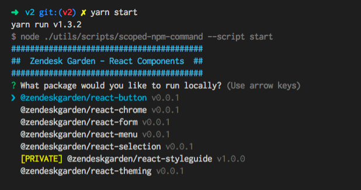

This will eventually include more info about developing in the Garden React repo...

Until then, here is a basic overview of what is being achieved.

## Repo Layout

The [react-components](https://github.com/zendeskgarden/react-components) repo is a mono-repo that contains all of the React related `@zendeskgarden` packages.

```
packages    // All packages
  - button
    - src   // Package src files
    - package.json   // Package specific dependencies and commands
    - styleguide.config.json    // Package specific documentation (headers, etc.)
  - chrome
  - styleguide   // Private GatsbyJS package that builds this documentation
  ...
package.json   // Contains all shared dependencies
lerna.json   // Tells Lerna how our project is laid out
```

### Technologies

Our mono-repo manages commands and inter-dependencies of packages with [LernaJS](https://lernajs.io/).

**This will probably change, but is true for these demo components**
- [CSS-Modules](http://www.google.com/)
  - Used to import existing styling from our [Garden CSS](http://todo.com) components
- [Styled-Components](https://www.styled-components.com/)
  - Used for advanced styling along with CSS-Modules
  - Also allows global theming and RTL maintenance

### Development Instructions

ToDo... not complete

#### Install Dependencies

First, we need to install all of our shared dependencies. This will also call `lerna bootstrap` which will install all package-specific dependencies and link anything that is shared.

```bash
yarn install
```

#### Running Components Locally

Since every package is self-contained, each has independently created documentation that must be ran separately. These can be ran at the same time, but must have different port numbers to serve simultaneously (customizable in the package's `styleguide.config.js`).

To start the local documentation run:

```bash
yarn start    // Shows prompt with list of packages to choose from
yarn start --scope @zendeskgarden/react-button    // Start specific package without prompt
```



#### Running Styleguide

The stylguide is a private package that runs on [GatsbyJS](https://www.gatsbyjs.org/). Some cool features are:

- Have a statically generated documentation site that can be ran from Github Pages
- Use our React components to style the site
  - `@zendeskgarden/react-chrome` is used as the wrapper for every page
- Dynamically query our packages using GraphQL
- Have MarkDown enabled documentation posts

```bash
yarn start --scope @zendeskgarden/react-styleguide
```

Provides you with a live-updating development environment as well as a [GraphiQL](https://github.com/graphql/graphiql) client at [http://localhost:8000/___graphql](http://localhost:8000/___graphql).


#### Other commands

Other root commands can be ran against all components.  Some examples are:

```bash
yarn run lint    // Run linting across all packages. Eslint and Stylelint for styled-components by default
yarn run build    // Run a standard babel build with a single, shared config
```
